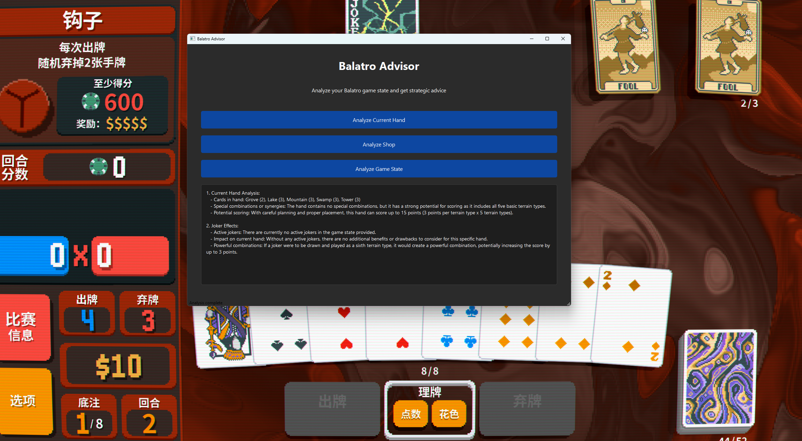

# Balatro Game Advisor

A Python application that provides real-time advice for the Balatro card game by analyzing the game state and providing strategic recommendations.

## Features

- Real-time game window detection and capture
- Analysis of current round state (cards, jokers, tarots, etc.)
- Shop analysis and purchase recommendations
- Long-term strategy advice
- Integration with OpenAI API for intelligent recommendations

## Requirements

- Python 3.8 or higher
- Balatro game installed
- ollama installed 
- local LLM deployed

## Installation

1. Clone this repository:
```bash
git clone https://github.com/yourusername/slayBalatro.git
cd slayBalatro
```

2. Create and activate a virtual environment:
```bash
python -m venv venv
# On Windows:
venv\Scripts\activate
# On Unix or MacOS:
source venv/bin/activate
```

3. Install the required packages:
```bash
pip install -r requirements.txt
```

4. Install Ollama and deploy your local LLM, here with a RTX 4090 24 GB VRAM, mixtral:latest was used.
```bash
pip install ollama
ollama pull mixtral:latest
```

## Usage

1. Start the Balatro game
2. Run the advisor application:
```bash
python balatro_advisor.py
```

demo



3. Use the buttons in the application to:
   - Analyze the current round
   - Get shop recommendations
   - Receive strategy advice

## How it Works

The application uses computer vision to capture and analyze the game window, then sends the information to a local deployed LLM(with Ollama) for intelligent analysis and recommendations. The application will automatically detect when the Balatro game is running and can provide real-time advice based on the current game state.
